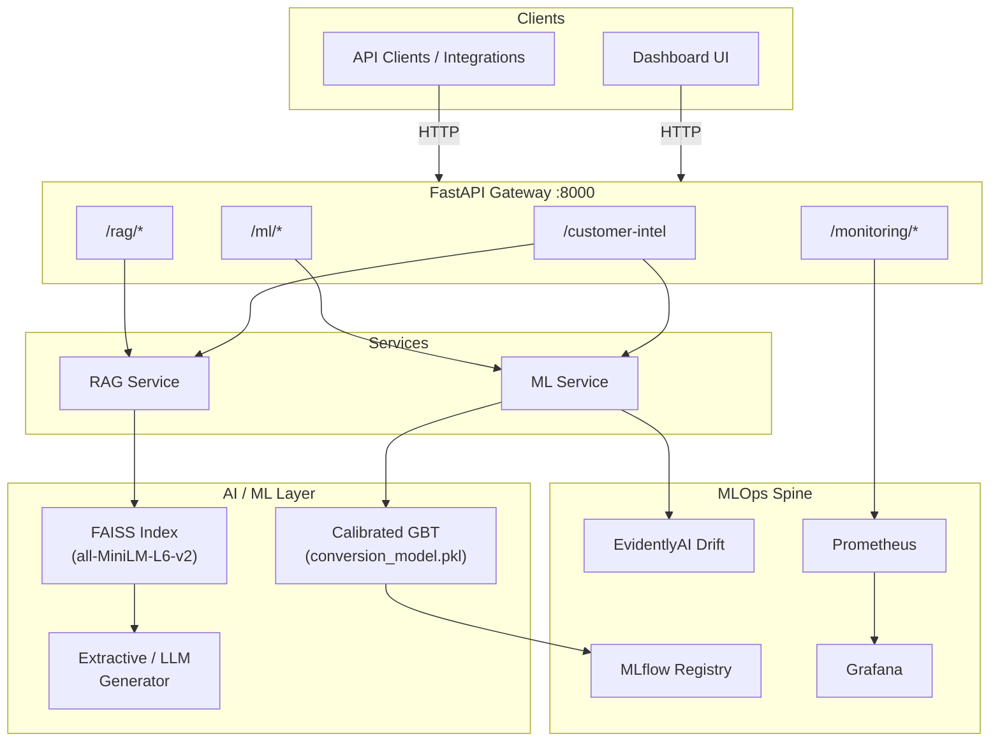
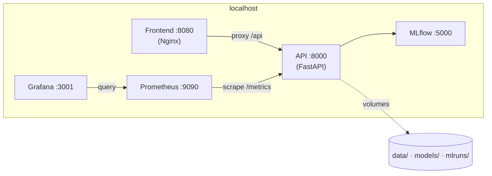
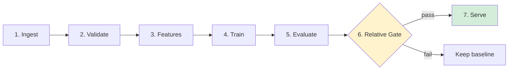
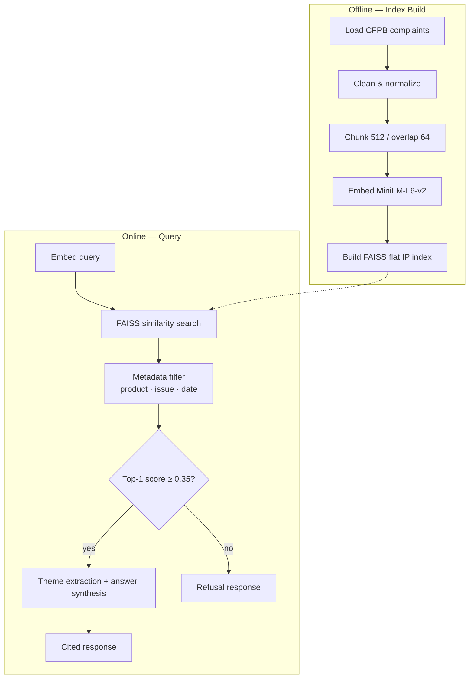
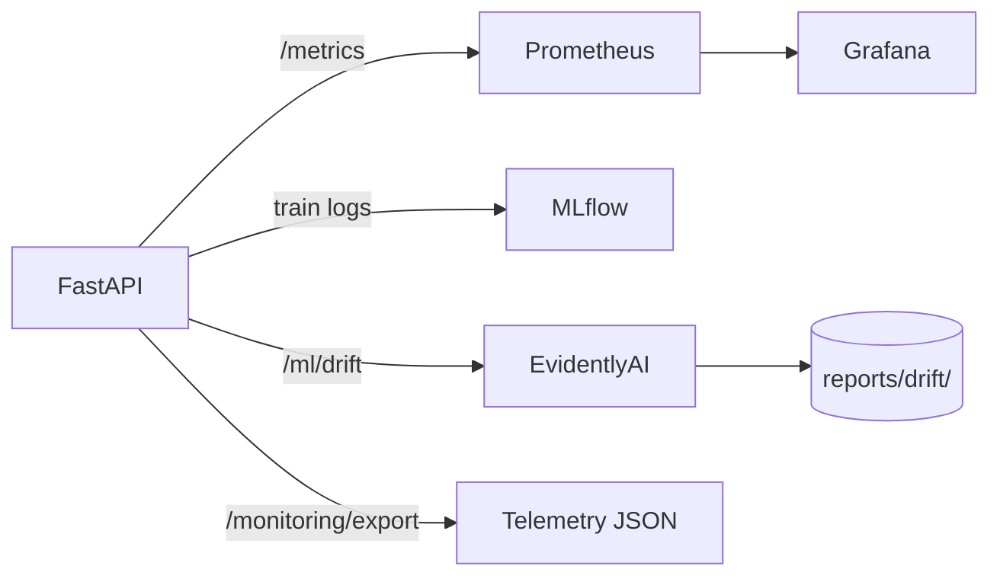

# Customer Intelligence Platform

**Production-grade AI for campaign conversion prediction and complaint intelligence — with a shared MLOps spine.**

Combine calibrated ML scoring on structured customer profiles with grounded RAG over financial complaints. One API gateway, one dashboard, and full observability from training through inference.

[](LICENSE)
[](https://www.python.org/)
[](https://fastapi.tiangolo.com/)
[](docker-compose.yml)

---

## Table of contents

- [What it does](#what-it-does)
- [Architecture](#architecture)
  - [System context](#system-context)
  - [Deployment topology](#deployment-topology)
  - [ML pipeline](#ml-pipeline-7-stages)
  - [RAG pipeline](#rag-pipeline-8-stages)
  - [MLOps spine](#mlops-spine)
- [Tech stack](#tech-stack)
- [Quick start](#quick-start)
- [API reference](#api-reference)
- [Configuration](#configuration)
- [Project structure](#project-structure)
- [Development](#development)
- [Documentation](#documentation)
- [License](#license)

---

## What it does

| Capability | Description |
|------------|-------------|
| **Campaign conversion ML** | Predict conversion probability from customer demographics with **calibrated** probabilities and `LOW` / `MEDIUM` / `HIGH` bands |
| **Complaint intelligence (RAG)** | Search CFPB-style narratives, extract themes, synthesize **grounded** answers with citations |
| **Unified intelligence** | Single `POST /customer-intel` fans out to ML + RAG in parallel and returns merged insights |
| **Model governance** | Relative promotion gate blocks regressions; metrics travel with serialized artifacts |
| **Observability** | Prometheus metrics, EvidentlyAI drift reports, MLflow tracking, Grafana dashboards |

---

## Architecture

### System context

Clients interact with a **FastAPI gateway** that routes to two AI services and a shared **MLOps spine**. Structured data flows to a calibrated Gradient Boosting model; unstructured complaints flow through embedding + FAISS retrieval.



### Deployment topology

All services run on a single Docker Compose network (`cip-net`). Persistent volumes hold MLflow artifacts, Prometheus TSDB, and Grafana state.



| Service | Port | Role |
|---------|------|------|
| **API** | `8000` | FastAPI — ML, RAG, monitoring, OpenAPI docs |
| **Frontend** | `8080` | Static dashboard (Nginx) |
| **MLflow** | `5000` | Experiment tracking & model registry |
| **Prometheus** | `9090` | Metrics scrape & retention (30d) |
| **Grafana** | `3001` | Dashboards (default login `admin` / see `.env`) |

### ML pipeline (7 stages)

Structured customer profiles become calibrated conversion probabilities.



| Stage | Responsibility |
|-------|----------------|
| **Ingest** | Load demographics or generate synthetic data in demo mode |
| **Validate** | Enforce bounds (age 18–100, credit score 300–850), drop nulls |
| **Features** | Engineer `wealth_score`, `balance_salary_ratio`, `products_per_year`; scale |
| **Train** | `GradientBoostingClassifier` + `CalibratedClassifierCV` (isotonic, cv=5) |
| **Evaluate** | AUC-ROC, PR-AUC, accuracy, precision, recall, F1 |
| **Relative gate** | Promote only if PR-AUC improves ≥3% **and** F1 does not drop >2% vs baseline |
| **Serve** | Persist `conversion_model.pkl`, `scaler.pkl`; expose `/ml/predict` |

**Design choice:** Baseline metrics are embedded in the serialized pickle for fast, dependency-free gate checks — no MLflow round-trip at promotion time. See [ADR 2](docs/decision_log.md).

### RAG pipeline (8 stages)

Bank complaint narratives are indexed offline and queried online with refusal on low similarity.



| Stage | Responsibility |
|-------|----------------|
| **Load** | Historical complaints CSV (`data/complaints/`) |
| **Clean** | Normalize narratives, strip noise |
| **Chunk** | Overlapping segments for retrieval granularity |
| **Embed** | `sentence-transformers/all-MiniLM-L6-v2` dense vectors |
| **Index** | FAISS inner-product index on disk |
| **Retrieve** | Top-k cosine search with optional metadata filters |
| **Synthesize** | Extractive summarization or LLM with source citations |
| **Refuse** | Score &lt; `0.35` → polite refusal, confidence `0.0` |

**Design choice:** Hard similarity cutoff prevents out-of-domain hallucination better than prompt-only guardrails. See [ADR 3](docs/decision_log.md).

### MLOps spine

Cross-cutting concerns shared by both AI services:



- **Prometheus** — Request counts, latencies, score distributions, FAISS vector count
- **EvidentlyAI** — Covariate shift vs reference baseline (`data/processed/reference.parquet`)
- **MLflow** — Experiment runs, artifact storage, registry stages
- **Structured export** — `GET /monitoring/export` for alerting pipelines

---

## Tech stack

| Layer | Technologies |
|-------|----------------|
| **API** | FastAPI, Uvicorn, Pydantic v2, Loguru |
| **ML** | scikit-learn, XGBoost, imbalanced-learn, joblib |
| **RAG** | LangChain, sentence-transformers, FAISS-CPU |
| **MLOps** | MLflow, Evidently, Prometheus, Grafana |
| **Infra** | Docker Compose, Nginx |
| **CI** | GitHub Actions (Ruff, pytest, Docker build) |

---

## Deploy on Azure

Full steps: **[azure/README.md](azure/README.md)**

```bash
az login
export API_SECRET_KEY="$(openssl rand -hex 32)"
chmod +x azure/deploy.sh azure/post-deploy.sh
./azure/deploy.sh
```

CI/CD: connect the repo in Azure DevOps and run **[azure-pipelines.yml](azure-pipelines.yml)** (set `API_SECRET_KEY` as a secret pipeline variable).

---

## Quick start

### Prerequisites

- [Docker](https://docs.docker.com/get-docker/) & Docker Compose v2
- 8 GB RAM recommended (embedding model + FAISS index build)

### Run the full stack

```bash
git clone https://github.com/yash-gupta-7/Customer-Intelligence-Platform.git
cd Customer-Intelligence-Platform
cp .env.example .env   # edit secrets as needed
docker compose up --build
```

### Bootstrap models (first run)

```bash
# Train conversion model (synchronous)
curl -X POST http://localhost:8000/ml/train/sync

# Build FAISS complaint index (synchronous)
curl -X POST http://localhost:8000/rag/index/build/sync
```

### Endpoints

| Resource | URL |
|----------|-----|
| **Dashboard** | http://localhost:8080 |
| **API docs (Swagger)** | http://localhost:8000/docs |
| **Health** | http://localhost:8000/health |
| **Metrics** | http://localhost:8000/metrics |
| **MLflow UI** | http://localhost:5000 |
| **Grafana** | http://localhost:3001 |

### Example — unified intelligence

```bash
curl -X POST http://localhost:8000/customer-intel \
  -H "Content-Type: application/json" \
  -d '{
    "customer_features": {
      "age": 42,
      "job": "management",
      "marital": "married",
      "education": "tertiary",
      "default": "no",
      "balance": 2500,
      "housing": "yes",
      "loan": "no",
      "contact": "cellular",
      "month": "may",
      "day_of_week": "mon",
      "duration": 180,
      "campaign": 1,
      "pdays": -1,
      "previous": 0,
      "poutcome": "unknown",
      "emp_var_rate": 1.1,
      "cons_price_idx": 93.2,
      "cons_conf_idx": -36.4,
      "euribor3m": 4.8,
      "nr_employed": 5191.0
    },
    "complaint_query": "Why are customers disputing credit card fees?",
    "product": "Credit card",
    "top_k": 5
  }'
```

---

## API reference

| Method | Path | Description |
|--------|------|-------------|
| `POST` | `/customer-intel` | Unified ML + RAG intelligence (parallel fan-out) |
| `POST` | `/ml/predict` | Single customer conversion prediction |
| `POST` | `/ml/batch-score` | Batch scoring (JSON list or CSV upload) |
| `POST` | `/ml/train/sync` | Train model synchronously |
| `POST` | `/ml/drift` | Run EvidentlyAI drift report |
| `GET` | `/ml/model/info` | Current model metadata & metrics |
| `POST` | `/rag/query` | Complaint search + grounded answer |
| `POST` | `/rag/index/build/sync` | Build FAISS index synchronously |
| `GET` | `/rag/index/status` | Index size and build status |
| `GET` | `/monitoring/export` | Telemetry JSON for alerting |
| `GET` | `/health` | Liveness probe |
| `GET` | `/metrics` | Prometheus scrape endpoint |

Interactive schemas: **http://localhost:8000/docs**

---

## Configuration

Copy `.env.example` to `.env`. Key variables:

| Variable | Purpose |
|----------|---------|
| `APP_ENV` | `development` \| `staging` \| `production` |
| `API_SECRET_KEY` | API authentication secret |
| `MLFLOW_TRACKING_URI` | MLflow server URL (`http://mlflow:5000` in Compose) |
| `MODEL_PATH` | Path to `conversion_model.pkl` |
| `FAISS_INDEX_PATH` | Directory for FAISS index files |
| `EMBEDDINGS_MODEL` | Sentence-transformer model ID |
| `RAG_TOP_K` | Retrieval depth (default `5`) |
| `GRAFANA_ADMIN_PASSWORD` | Grafana admin password |

See [.env.example](.env.example) for the full list.

---

## Project structure

```
Customer-Intelligence-Platform/
├── backend/
│   ├── app/
│   │   ├── main.py              # FastAPI entrypoint & middleware
│   │   ├── config.py            # Pydantic settings
│   │   ├── ml/                  # 7-stage conversion pipeline
│   │   ├── rag/                 # 8-stage complaint intelligence
│   │   ├── monitoring/          # Prometheus & logging
│   │   ├── routers/             # HTTP route handlers
│   │   └── schemas/             # Request/response models
│   ├── tests/                   # pytest suite
│   ├── Dockerfile
│   └── requirements.txt
├── frontend/
│   └── index.html               # Dashboard UI
├── infra/
│   ├── nginx.conf               # Reverse proxy config
│   └── prometheus.yml           # Scrape targets
├── docs/
│   ├── architecture.md          # Extended design notes
│   ├── decision_log.md          # ADRs
│   └── hardening_plan.md        # Production security checklist
├── .github/workflows/           # CI & deploy pipelines
└── docker-compose.yml
```

---

## Development

### Local backend (without Docker)

```bash
cd backend
python -m venv venv && source venv/bin/activate
pip install -r requirements.txt
uvicorn app.main:app --reload --port 8000
```

### Tests

```bash
cd backend
pytest -v --cov=app
```

### CI pipeline

On every push to `main` / `develop` and on pull requests:

1. **Lint** — Ruff check & format
2. **Test** — pytest with coverage
3. **Build** — Docker image build & push (on `main`)

See [.github/workflows/ci.yml](.github/workflows/ci.yml).

---

## Documentation

| Document | Contents |
|----------|----------|
| [docs/architecture.md](docs/architecture.md) | Extended system design & data layouts |
| [docs/decision_log.md](docs/decision_log.md) | Architectural decision records (ADRs) |
| [docs/hardening_plan.md](docs/hardening_plan.md) | Rate limiting, input scrubbing, RAG security |

---

## License

MIT © [yash-gupta-7](https://github.com/yash-gupta-7) — see [LICENSE](LICENSE).
