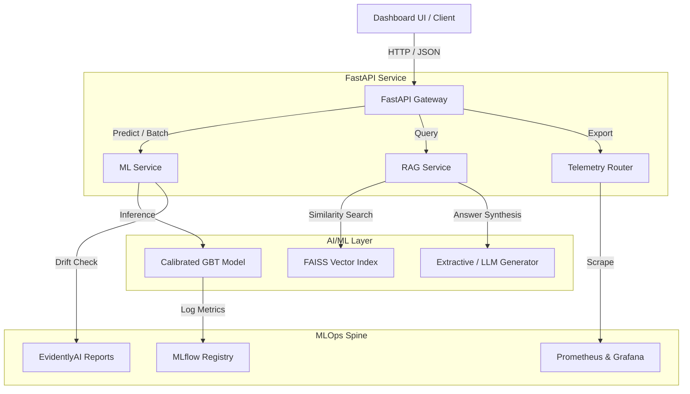

# Customer Intelligence Platform Architecture

This document describes the high-level system design, data pipelines, and database layouts of the Customer Intelligence Platform.

## System Overview

The Customer Intelligence Platform is a production-grade AI system that combines **ML Campaign Conversion Prediction** and **RAG-based Complaint Intelligence** with a shared **MLOps spine** for tracking, monitoring, and telemetry.

---

## Component Details

### 1. ML Service (Campaign Conversion Prediction)
A 7-stage ML pipeline that converts structured customer profiles into campaign conversion probabilities:
1. **Ingest:** Load customer demographics or generate synthetics in demo mode.
2. **Validate:** Verify range parameters (e.g. age 18-100, credit score 300-850) and drop null rows.
3. **Features:** Engineer derived variables (`wealth_score`, `balance_salary_ratio`, `products_per_year`) and apply standard scaling.
4. **Train:** Fit a Gradient Boosting Classifier calibrated using `Isotonic Calibration` (CalibratedClassifierCV) for reliable probability predictions.
5. **Evaluate:** Compute standard metrics (AUC-ROC, PR-AUC, Accuracy, Precision, Recall, F1).
6. **Relative Gate:** Compare new model's `pr_auc` and `f1` against the baseline production model (blocking promotion if PR-AUC doesn't improve by at least +3% or if F1 degrades by more than 2%).
7. **Serve:** Serialize and persist model artifacts (`conversion_model.pkl`, `scaler.pkl`) to disk.

### 2. RAG Service (Complaint Intelligence)
An 8-stage RAG pipeline that searches bank customer complaints to extract insights and themes:
- **Index Build (Offline):** Loads historical CFPB complaints dataset, cleans/normalizes narratives, segments into overlapping chunks, computes dense vectors using `all-MiniLM-L6-v2`, and builds a flat IP FAISS vector index.
- **Query Pipeline (Online):** Computes query embeddings, performs cosine similarity search in FAISS with metadata filtering (by product, issue, and date), extracts themes based on keyword frequencies, synthesizes grounded answers using extractive summarization or LLMs, and cites sources.
- **Refusal System:** If the top retrieved chunk's similarity score is less than `0.35`, the system politely refuses to answer, protecting against adversarial or out-of-domain prompts.

### 3. Telemetry & Observability
- **Prometheus Metrics:** Exposes request counts, latencies, model probability distributions, and FAISS index counts on `/metrics`.
- **EvidentlyAI Drift reports:** Detects covariate shift between active input datasets and the training reference baseline.
- **Structured telemetric export:** Exposes `/monitoring/export` to retrieve real-time performance metrics, drift summaries, and model relative gate audits in a clean JSON format for automated alerting.
