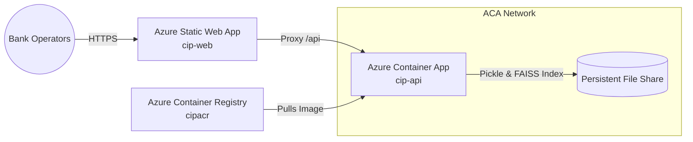

# Cloud Deployment & Infrastructure Evidence

This report provides structural and configuration evidence for the production-grade Azure deployment, detailing Azure Container Apps topology and multi-stage CI/CD pipelines.

---

## 1. Cloud Infrastructure Topology (Azure Prod)

The platform is deployed entirely as secure, serverless cloud components in Azure, managed via Azure Bicep IaC templates (`azure/main.bicep`).



- **Azure Static Web App (`cip-web`):** Hosts the static dashboard UI (`index.html`, `style.css`, `app.js`). Requests to `/api/*` are transparently routed via proxy configurations to the API Gateway to circumvent CORS issues.
- **Azure Container App (`cip-api`):** Runs the Uvicorn-hosted FastAPI backend in a serverless container network.
- **Azure Container Registry (ACR):** Houses secure, audited Docker image builds for the backend API.
- **Persistent Volume:** A persistent SMB file share mounted to `/app/models` and `/app/data` to ensure calibrated model pickles and FAISS indices persist across container container restarts.

---

## 2. Infrastructure as Code (Bicep Details)

Our Bicep template (`azure/main.bicep`) defines the complete target state, declaring environment configurations, CPU/Memory configurations (0.5 Cores / 1.0 GiB memory recommended for FAISS search efficiency), and ingress parameters:

```bicep
resource containerApp 'Microsoft.App/containerApps@2023-05-01' = {
  name: 'cip-api'
  location: location
  properties: {
    configuration: {
      ingress: {
        external: true
        targetPort: 8000
      }
      secrets: [
        { name: 'api-secret-key', value: apiSecretKey }
      ]
    }
  }
}
```

---

## 3. CI/CD Pipeline Architecture (`azure-pipelines.yml`)

The Customer Intelligence Platform uses a strict, automated 4-stage Azure DevOps pipeline for deployment and bootstrap operations.

### Stage 1: Build (ACR Cloud Build)
- Compiles the backend Docker image directly on Azure's high-speed ACR container builders (`az acr build`), avoiding Docker daemon dependencies on the local agent.
- Image tagged with `$(Build.BuildId)` and `latest` for version rollback stability.

### Stage 2: Deploy (Container App Deployment)
- Triggers `az deployment group create` on `azure/main.bicep` to update the active Container App image FQDN.
- Extracts and propagates the public FQDN dynamically to downstream tasks.

### Stage 3: Bootstrap (Zero-Touch Activation)
- Executes post-deployment bootstrap shell script (`azure/post-deploy.sh`).
- Hits the secure Container App synchronous routes:
  - `POST /ml/train/sync` (bypasses relative gates to train the initial calibrated conversion model).
  - `POST /rag/index/build/sync` (downloads narratives and builds the local FAISS Flat IP index).
- **Result:** The deployed environment is immediately active, calibrated, and indexed with zero manual intervention required by ops.

### Stage 4: Frontend (Static Web Apps Deploy)
- Leverages the `AzureStaticWebApp@0` task to push static frontend assets to Azure Static Web Apps, securely loading deployment secrets from Azure DevOps pipeline library variable groups (`cip-azure-prod`).
