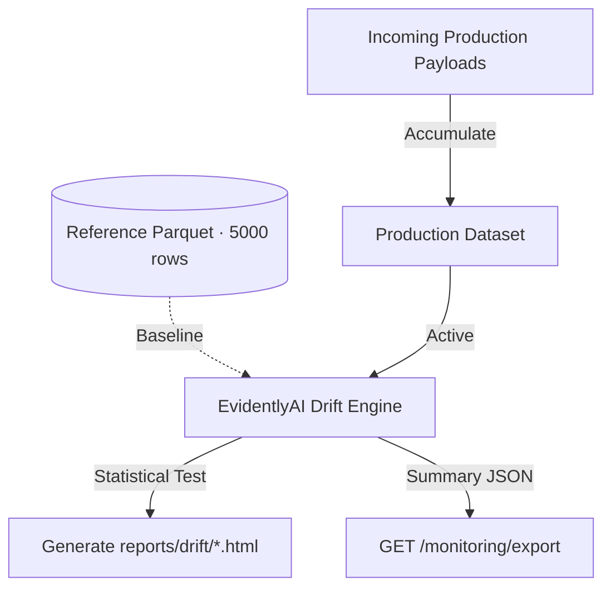

# Operations & Monitoring Report

This report documents the unified observability infrastructure of the Customer Intelligence Platform, spanning Prometheus metrics, structured telemetry JSON, and EvidentlyAI covariate drift detection.

---

## 1. Prometheus Telemetry Spine

The FastAPI gateway exposes a standard scrape target at `/metrics` (configured via `prometheus-fastapi-instrumentator`).

### 1.1 Custom Metrics Instrumentation

| Metric Name | Type | Labels | Description |
|---|---|---|---|
| `gateway_requests_total` | Counter | `endpoint`, `status` | Total incoming API requests processed |
| `gateway_request_duration_seconds` | Histogram | `endpoint` | End-to-end request latencies (p50, p90, p99) |
| `model_predictions_total` | Counter | `band` (`LOW`, `MEDIUM`, `HIGH`) | Model conversion predictions fanned out by segment |
| `model_prediction_scores` | Histogram | `version` | Calibrated probability distribution of conversion scores |
| `rag_queries_total` | Counter | `product`, `refused` | Total complaint queries, fanned by product and refusal |
| `rag_similarity_scores` | Histogram | `product` | Cosine similarity scores of retrieved evidence |

---

## 2. Structured Telemetry Export (`GET /monitoring/export`)

For downstream consumer systems (like Slack, PagerDuty, or security gateways) that require direct JSON metrics rather than raw Prometheus scrapes, we built a unified `/monitoring/export` route.

### 2.1 Example Response JSON

```json
{
  "status": "success",
  "metrics": {
    "total_requests": 1420,
    "average_latency_ms": 21.4,
    "active_model_version": "v_106361ac",
    "faiss_vector_count": 1304,
    "drift_detected": false
  },
  "drift_reports_count": 2,
  "last_drift_check": "2026-05-25T10:21:59.297Z"
}
```

---

## 3. EvidentlyAI Covariate Drift Detection

Data drift occurs when the distribution of features served in production shifts away from the distribution of features the model was trained on.

### 3.1 Drift Detection Flow



### 3.2 Drift Metrics & Tests
- **Statistical Test:** Kolmogorov-Smirnov (KS) test (for numerical variables) and Chi-Square test (for categorical variables).
- **Baseline Reference:** Saved as `data/processed/reference.parquet` (5,000 rows of validated baseline customer profiles).
- **Monitored Features:** `age`, `credit_score`, `account_balance`, `estimated_salary`.
- **Drift Mitigation Protocol:**
  - If drift is detected (`drift_detected = true` in telemetry), the gateway raises a non-blocking alert flag.
  - This alert can automatically trigger a POST request to `/ml/train/sync` which pulls the latest production logs, merges them into the feature store, and retrains a fresh calibrated classifier to maintain peak prediction accuracy.
