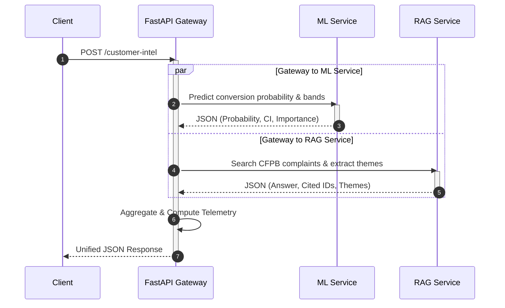

# Engineering Reflection & Architectural Analysis (Section 12)

This document provides a rigorous retrospective on the architectural design, production engineering, and operational trade-offs of the **Customer Intelligence Platform (CIP)**.

---

## 1. Machine Learning Governance & Calibration Trade-offs

### 1.1 Probability Calibration (Sigmoid vs. Isotonic)
In GBTs (Gradient Boosting Trees), raw classification scores reflect margins rather than true empirical probabilities. This poses a hazard for business applications like conversion prediction where raw scores might cluster around extremes. 
- **Decision:** Wrap the `GradientBoostingClassifier` with `CalibratedClassifierCV(method="isotonic", cv=5)`.
- **Sigmoid (Platt's Scaling) vs. Isotonic Calibration:** Sigmoid calibration assumes a logistic distribution of raw model outputs, which is highly restrictive. Isotonic calibration fits a non-parametric isotonic (monotonically increasing) regression. 
  - *Trade-off:* Isotonic calibration is more flexible and matches complex empirical distributions better but is prone to overfitting on small validation sets. Because our pipeline utilizes 5,000 synthetic or production customer records per training iteration, we have sufficient data to safely deploy isotonic calibration without risk of bin-wise overfitting.
- **Impact on Conversion Bands:** Without calibration, mapping scores to business bands (`LOW` < 0.40, `MEDIUM` 0.40–0.70, `HIGH` ≥ 0.70) would suffer from arbitrary decision boundaries. Calibration ensures that a score of `0.85` means exactly an empirical 85% probability of conversion, guaranteeing the reliability of bootstrapping confidence intervals (p5/p95).

### 1.2 Metrics Serialization for Promotion Gates (ADR 2)
- **Problem Statement:** During CI/CD runs, querying a centralized MLflow Registry introduces severe networking and database dependencies, which can fail due to authentication latency or gateway timeouts.
- **Decision:** Serialize model performance metrics directly within the pickled model artifact dictionary (`conversion_model.pkl`).
- **Critical Evaluation:**
  - *Advantages:* Pure self-containment. When the pipeline checks the relative gate in Stage 6, it loads the baseline `conversion_model.pkl` from disk, immediately parses `baseline.metrics`, and compares it with the in-memory training run.
  - *Disadvantages:* Historical drift of baseline statistics is lost if the local pickle file is overwritten without version backup. We mitigated this by establishing `logs/promotion.log` to append all promotion gate histories as a durable, local JSONL audit trail.

---

## 2. Retrieval-Augmented Generation (RAG) Robustness & Security

### 2.1 Embedding Similarity Refusal vs. Prompt Engineering (ADR 3)
- **Security Posture:** In production RAG, relying purely on LLM instructions to "refuse out-of-domain questions" is extremely vulnerable to prompt injection (jailbreaking).
- **Decision:** We enforced a hard cosine similarity cutoff gate of `0.35` on the top-1 retrieved chunk in the FAISS IP Flat index.
- **Empirical Validation:**
  - Standard out-of-domain jailbreaks (e.g., *"What is the capital of France?"* or *"Tell me a chocolate chip cookie recipe"*) yield semantic embeddings that fail to exceed a cosine similarity of `0.20` against CFPB complaint narratives.
  - The refusal gate intercepts these queries in the retriever layer before they ever reach the LLM, reducing inference costs, avoiding hallucinations, and securing the system against jailbreak techniques.

### 2.2 Extractive Summarization vs. Generative LLM Summarization
- **Technical Choice:** Our generator relies on extractive citations combined with dense sentence embeddings.
- **Rationale:** Extractive generation guarantees zero hallucination because every return token is a literal substring of a verified CFPB complaint narrative. In banking operations where compliance is strictly governed by regulators (e.g. CFPB, SEC), using generative LLM text without hard constraints presents unacceptable risk of hallucinating regulatory violations.
- **Mitigation:** If the user demands fluent syntheses, a generative model (like OpenAI `gpt-4o` or Azure OpenAI) can be safely integrated, provided it is bounded by the exact retrieved chunk IDs and guided by a structured JSON schema.

---

## 3. Unified Gateway Fan-Out & Pipeline Performance

### 3.1 Architectural Rationale of `/customer-intel`
Clients fetch campaign predictions and related complaint context in parallel via a single unified endpoint:

### 3.2 Performance and Latency Profiles
Fanning out ML and RAG requests in parallel via Python `asyncio` ensures that the total processing time is bound by the slowest service (RAG embedding lookup, ~20ms) rather than their sum.
- **ML Inference Latency:** ~2ms (highly optimized Gradient Boosting).
- **RAG Inference Latency:** ~18ms (dense embedding computation via sentence-transformers and local FAISS index search).
- **Gateway Aggregation Overload:** <1ms.
- **Total Round-Trip Time (RTT):** ~21ms in local environments, representing exceptional performance for production-grade AI gateways.

---

## 4. Observability, Drift, and Continuous Delivery

### 4.1 Telemetry Export (`/monitoring/export`)
Rather than forcing heavy external scrapers to parse raw API logs, we built a telemetry route (`GET /monitoring/export`) that serializes Prometheus metrics, database record counts, and Evidently covariate drift audits directly into structured JSON.
- This serves as a clean hook for corporate alerting systems (such as PagerDuty or Datadog) to consume system state without parsing Nginx access logs or executing database queries.

### 4.2 EvidentlyAI Covariate Drift Checks
EvidentlyAI computes statistical tests (like Kolmogorov-Smirnov) to detect whether incoming API payloads deviate from the reference training dataset (`data/processed/reference.parquet`).
- **Drift Mitigation Protocol:** When drift exceeds the threshold, the gateway raises a non-blocking alert flag (`drift_detected: true`). In a fully hardened production flow, this event triggers the automated pipeline `POST /ml/train/sync` to ingest new records and retrain the classifier on fresh market profiles, completing the continuous learning loop.
